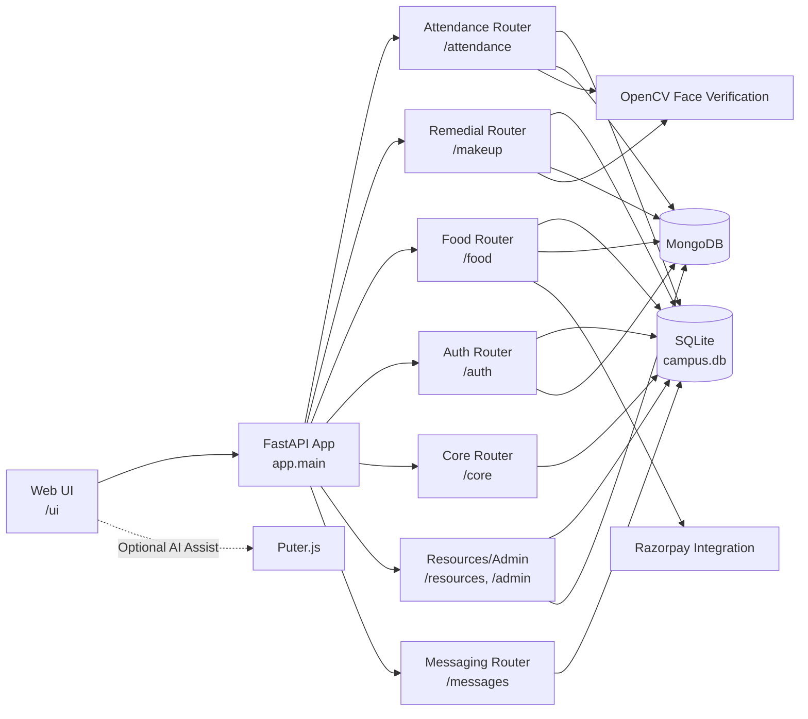
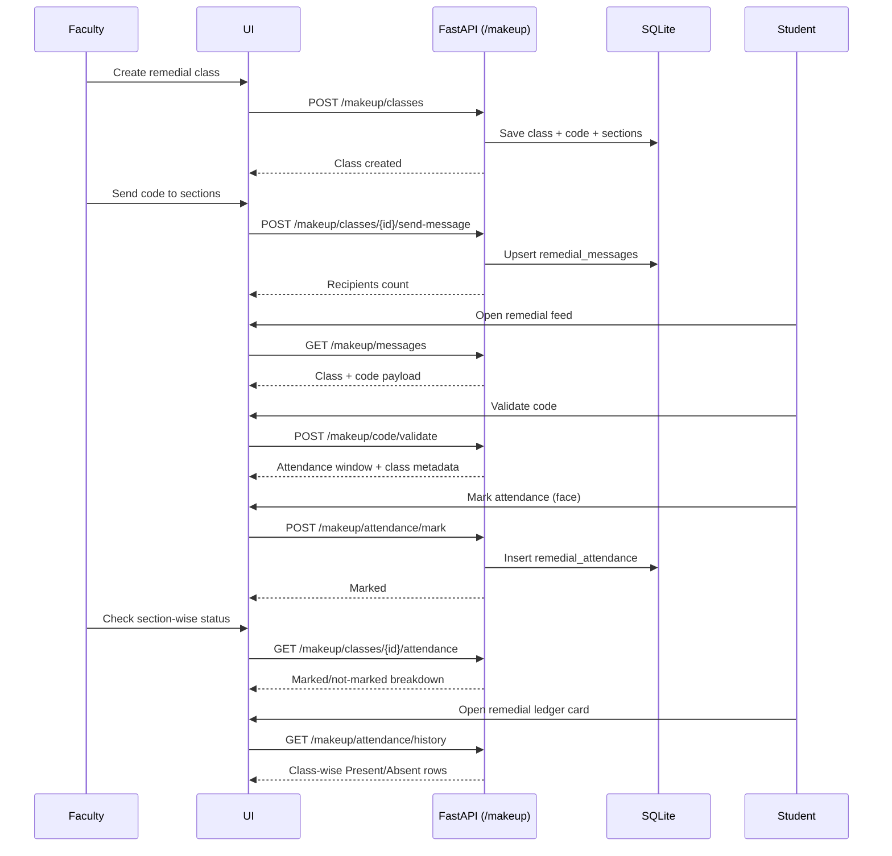

<div align="center">
  
  <h1>LPU Smart Campus Management System</h1>
  <p><strong>Production-style campus operations platform with realtime attendance, remedial workflows, food pre-ordering, and analytics.</strong></p>

  <p>
    
    
    
    
    
    
    
    
  </p>
</div>

---

## Overview

This project is a complete Smart Campus platform that unifies academic and operational workflows for:

- Student attendance (realtime face-verified + faculty review pipeline)
- Make-up/remedial class lifecycle (schedule, code distribution, mark, audit)
- Smart food ordering (slot-based, geofenced, payment-safe)
- Campus resource management and live admin insights
- OTP-first authentication and role-based access control

It is designed as a **single FastAPI backend + single web UI** with strong modular boundaries and production-minded constraints.

---

## Table Of Contents

- [What The System Delivers](#what-the-system-delivers)
- [3D Project Visual](#3d-project-visual)
- [Architecture Diagrams](#architecture-diagrams)
- [Module Breakdown (Implemented)](#module-breakdown-implemented)
- [API Surface Summary](#api-surface-summary)
- [Tech Stack](#tech-stack)
- [Project Structure](#project-structure)
- [Run Locally](#run-locally)
- [Configuration](#configuration)
- [How Core Flows Work](#how-core-flows-work)
- [Testing And Quality](#testing-and-quality)
- [Security And Reliability](#security-and-reliability)
- [Future Prospects](#future-prospects)

---

## What The System Delivers

### For Students

- Secure OTP login
- Weekly timetable with attendance status
- Realtime attendance marking with strict face verification
- Remedial code validation and attendance marking
- Subject-wise remedial attendance ledger with class-wise present/absent records
- Food ordering with delivery-state tracking
- Faculty message center

### For Faculty

- Schedule and manage class attendance windows
- Bulk attendance operations
- Pending-submission review workflow
- Section-targeted messaging
- Remedial class creation, code sending, and section-level attendance monitoring
- Classroom analysis capture and history

### For Admin/Owner

- Realtime summary metrics and alerts
- Capacity and workload analytics
- SQL-Mongo consistency visibility
- Department/classroom bootstrap operations

---

## Architecture Diagrams

### 1) High-Level System Architecture



### 2) Remedial Module Runtime Flow



---

## Module Breakdown (Implemented)

### 1) Authentication & Identity (`/auth`)

- OTP login request + verify
- Password policy and password-reset OTP
- Alternate email flow
- HTTP-only session cookie support
- Role-based user model (`admin`, `faculty`, `student`, `owner`)
- Mongo-backed auth identity storage with sequence-safe IDs

### 2) Core Setup (`/core`)

- Student, faculty, course, enrollment, classroom setup APIs
- Faculty-scoped creation rules where applicable
- SQL + Mongo mirror synchronization on create paths

### 3) Smart Attendance (`/attendance`)

- Schedule management
- Student timetable and profile lifecycle
- Realtime attendance mark endpoint
- Faculty review queues and classroom analysis
- Attendance summaries, absentees, and notifications
- Enrollment video/profile-photo lock-window controls

### 4) Make-Up / Remedial (`/makeup`)

- Remedial class scheduling with section targeting
- Code generation/regeneration windows
- Section fan-out messaging
- Student code validation
- Face-verified remedial attendance marking
- Faculty section-level attendance drilldown
- Student remedial history including present/absent class rows

### 5) Faculty Messaging (`/messages`)

- Section-targeted announcement sending
- Unified student feed with remedial context rows

### 6) Smart Food Pre-Ordering (`/food`)

- Shop/menu/slot management
- Cart and checkout flows
- Geofence validation
- Order status lifecycle + audit trail
- Payment intent, verification, webhook and failure handling
- Recovery endpoints and live demand analytics

### 7) Resources & Admin (`/resources`, `/admin`)

- Capacity/workload overview
- Live summaries and alerts
- SQL vs Mongo consistency checks
- Admin bootstrap and insight endpoints

---

## API Surface Summary

| Router | Prefix | Endpoints |
|---|---|---:|
| Authentication | `/auth` | 12 |
| Core Setup | `/core` | 10 |
| Attendance | `/attendance` | 25 |
| Food | `/food` | 36 |
| Remedial | `/makeup` | 11 |
| Messaging | `/messages` | 2 |
| Resources | `/resources` | 5 |
| Admin | `/admin` | 7 |
| Assets | `/static/*` | 1 |
| **Total** |  | **109** |

Use Swagger for full contracts and try-it flows: `http://127.0.0.1:8000/docs`

---

## Tech Stack

### Backend

- FastAPI
- SQLAlchemy 2.x
- Pydantic 2.x
- PyMongo
- OpenCV (face verification)
- python-dotenv
- Razorpay SDK

### Frontend

- Vanilla JS SPA (`web/app.js`)
- HTML/CSS (`web/index.html`, `web/styles.css`)
- Optional client-side AI assistance via Puter.js

### Persistence

- SQLite (`campus.db`) for transactional relational data
- MongoDB for auth and mirrored realtime/analytics/event views

---

## Project Structure

```text
app/
  main.py
  database.py
  models.py
  schemas.py
  mongo.py
  auth_utils.py
  face_verification.py
  food_bootstrap.py
  routers/
    auth.py
    people.py
    attendance.py
    food.py
    makeup.py
    messages.py
    resources.py
    admin.py
    assets.py

web/
  index.html
  styles.css
  app.js
  assets/

tests/
  test_*.py

scripts/
  food_payment_e2e.py
  realtime_mongo_audit.py
```

---

## Run Locally

### Prerequisites

- Python 3.12
- MongoDB URI (Atlas or compatible)

### Setup

```bash
python3.12 -m venv .venv
source .venv/bin/activate
pip install -r requirements.txt
cp .env.example .env
```

### Start

```bash
uvicorn app.main:app --reload --host 127.0.0.1 --port 8000 \
  --reload-dir app --reload-dir web \
  --reload-exclude '.venv/*' --reload-exclude '.venv_*/*'
```

### Access

- Health: `http://127.0.0.1:8000/`
- API Docs: `http://127.0.0.1:8000/docs`
- Web UI: `http://127.0.0.1:8000/ui`

---

## Configuration

Minimum `.env` keys:

```env
MONGO_URI=<your_mongo_uri>
MONGO_DB_NAME=lpu_smart
MONGO_PERSISTENCE_REQUIRED=true
MONGO_STARTUP_STRICT=true

OTP_DELIVERY_MODE=smtp
OTP_SMTP_HOST=smtp.gmail.com
OTP_SMTP_PORT=587
OTP_SMTP_USERNAME=<sender@gmail.com>
OTP_SMTP_PASSWORD=<app_password>
OTP_FROM_EMAIL=<sender@gmail.com>

RAZORPAY_KEY_ID=<optional>
RAZORPAY_KEY_SECRET=<optional>
```

Notable optional controls:

- `ALLOW_DEMO_SEED`
- `MONGO_READ_PREFERRED`
- `MONGO_STARTUP_SQL_SNAPSHOT_SYNC`
- `FACE_MATCH_PASS_THRESHOLD`
- `FACE_MATCH_MIN_FRAMES`
- `APP_ACCESS_COOKIE_NAME`, `APP_COOKIE_SECURE`

---

## How Core Flows Work

### Attendance

1. Faculty creates/loads schedules.
2. Student opens timetable and marks attendance in active window.
3. Backend verifies face frames and persists attendance.
4. Faculty review dashboard resolves pending submissions.
5. Aggregate/history views are updated for students.

### Remedial

1. Faculty creates remedial class and section scope.
2. Code is sent section-wise to eligible students.
3. Student validates code, marks attendance via face verification.
4. Faculty sees section marked/not-marked counters.
5. Student ledger shows class-wise present/absent by subject.

### Food

1. Student selects shop, slot, and items.
2. Cart checkout executes idempotent order placement.
3. Payment intent/verification updates order state.
4. Demand and peak analytics update operational panels.

### Admin Analytics

1. Dashboard aggregates summary, capacity, workload, alerts.
2. Resources endpoints expose campus-level utilization.
3. SQL-Mongo consistency checks support operational confidence.

---

## Testing And Quality

The suite covers critical functional domains including auth, attendance, remedial, and food payment hardening.

Run all tests:

```bash
PYTHONPATH=. .venv/bin/pytest -q
```

Run targeted tests:

```bash
PYTHONPATH=. .venv/bin/pytest -q tests/test_remedial_ledger.py
PYTHONPATH=. .venv/bin/pytest -q tests/test_food_payment_hardening.py
PYTHONPATH=. .venv/bin/pytest -q tests/test_auth_password_policy.py
```

---

## Security And Reliability

- Role-based authorization at router boundaries
- OTP-first login with cooldown and expiry controls
- Password strength policy enforcement
- HTTP-only cookie support for safer session handling
- Multi-frame OpenCV verification and anti-spoof checks
- Remedial section-target authorization
- Idempotency and replay-safe payment webhook handling
- Mongo index/TTL hardening
- SQL -> Mongo startup snapshot sync support

---

## Future Prospects

### 1) Platform Hardening

- Refresh-token rotation and stronger session management
- Request rate limiting per endpoint class
- Structured audit export and incident tracing

### 2) Scalability

- Migration path from SQLite to PostgreSQL
- Async task queue for heavy operations
- Websocket channels for true push-based realtime updates

### 3) AI + Analytics Enhancements

- Attendance anomaly prediction
- Remedial effectiveness tracking by cohort
- Smarter demand forecasting and kitchen load balancing

### 4) Product UX

- Fully captured screenshot assets for all roles/modules
- Improved accessibility pass and keyboard-first navigation
- Internationalization and richer reporting exports

### 5) Future Prospects / What’s Coming Next

Near-Term (Next Releases)
- Mobile-first experience (PWA/Android app) for students and faculty.
- Real push notifications (email + SMS + in-app) for attendance, remedial windows, and food order events.
- Rich report exports (PDF/CSV) for attendance, remedial outcomes, and admin analytics.
- Better dashboard personalization by role (student/faculty/admin presets).
- 
Attendance Roadmap
- Stronger anti-spoof and liveness checks with improved false-positive control.
- Classroom-level geofence + schedule-aware attendance constraints.
- At-risk student prediction using attendance trend scoring.
- Auto-generated faculty intervention recommendations for low-attendance cohorts.
- 
Remedial Module Roadmap
- AI-assisted remedial scheduling suggestions based on absentee patterns.
- Remedial effectiveness scoring (before vs after attendance/performance).
- Automated reminder workflow before attendance window closes.
- Section-wise remedial planner with conflict-aware slot recommendations.
  
Food Module Roadmap
- Inventory-aware ordering (auto sold-out and replenishment triggers).
- Dynamic prep-time and ETA prediction based on live queue load.
- Expanded payment + refund automation and reconciliation dashboard.
- Personalized meal recommendations using order history and demand patterns.

Platform & Engineering Roadmap
- Migration path from SQLite to PostgreSQL for production scale.
- Redis caching + background workers (Celery/RQ) for heavy async tasks.
- Real-time updates via WebSockets instead of polling-only flows.
- Full CI/CD pipeline with automated test gates and deployment checks.
- Centralized observability (structured logs, metrics, traces, alerting).

Security & Compliance Roadmap
- Fine-grained RBAC (feature-level permissions, not just role-level).
- Extended audit trail for all critical actions (auth, attendance, payments, remedial).
- Data retention and privacy policies for biometric artifacts.
- Hardening for enterprise deployment (secrets management, rotation, rate limits, abuse controls).

---
