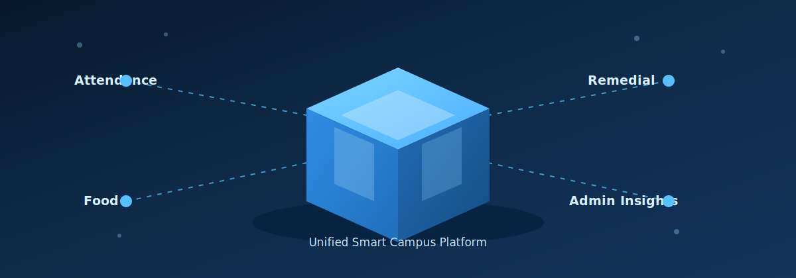
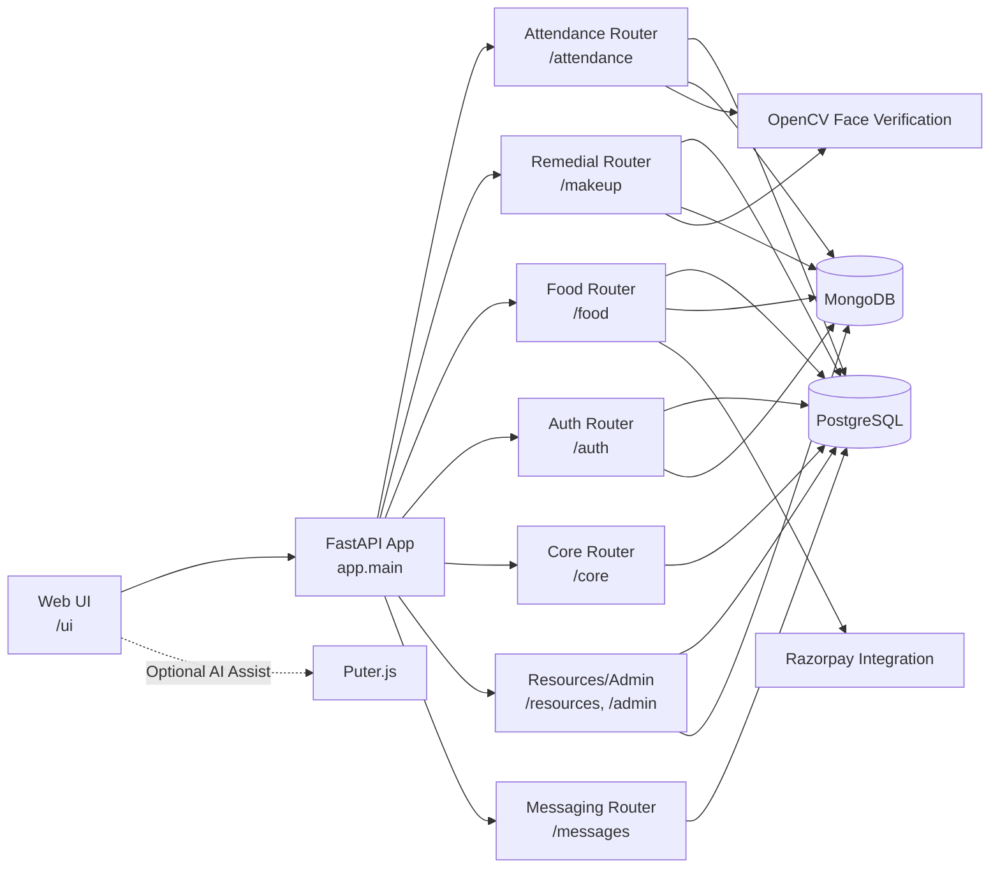
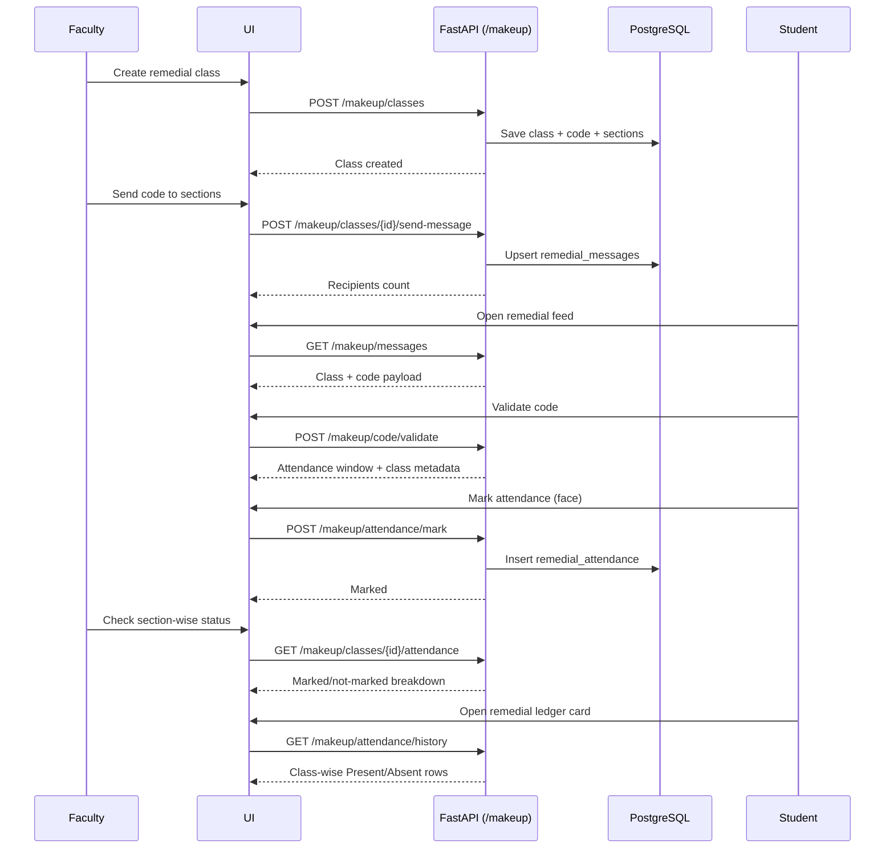

<div align="center">
  
  <h1>LPU Smart Campus Management System</h1>
  <p><strong>Production-style campus operations platform with realtime attendance, remedial workflows, food pre-ordering, and analytics.</strong></p>

  <p>
    
    
    
    
    
    
    
    
    
  </p>
</div>

---

## Overview

This project is a complete Smart Campus platform that unifies academic and operational workflows for:

- Student attendance (realtime face-verified + faculty review pipeline)
- Make-up/remedial class lifecycle (schedule, code distribution, mark, audit)
- Smart food ordering (slot-based, geofenced, payment-safe)
- Campus resource management, RMS workflows, and live admin insights
- Enterprise controls for SSO, SCIM, compliance, DR, and encryption rotation
- AI-assisted student/faculty support via Saarthi and Copilot
- OTP-first authentication and role-based access control

It is designed as a **single FastAPI backend + single web UI** with strong modular boundaries and production-minded constraints.

### Current Upgrade Highlights

- `web/app.js` now uses route-level lazy modules for attendance, messaging, and RMS realtime behavior.
- Attendance/message/RMS updates are push-driven via server-sent events (`/events/stream`) instead of periodic polling.
- Redis is used for distributed cache, API rate limiting primitives, and cross-instance realtime fanout.
- Worker scaffolding is added with Celery-compatible task dispatch (OTP, notifications, face reverify, recomputation).
- The backend now exposes dedicated router groups for `copilot`, `identity-shield`, `saarthi`, `enterprise`, `events`, and `observability`.
- Runtime strict mode is enabled by default (`APP_RUNTIME_STRICT=true`) and enforces:
  - `REDIS_REQUIRED=true`
  - `WORKER_REQUIRED=true`
  - `WORKER_ENABLE_OTP/NOTIFICATIONS/FACE_REVERIFY/RECOMPUTE=true`
  - `WORKER_INLINE_FALLBACK_ENABLED=false`
- Observability layer now includes:
  - structured JSON logs with trace IDs (`X-Trace-Id`)
  - request metrics (`/metrics`)
  - error budget and alert endpoints (`/observability/error-budget`, `/observability/alerts`)
- Local and shared app URLs should be fronted with [Slim](https://slim.sh) so the web app is accessed over stable HTTPS domains such as `https://campus.test/ui` instead of raw localhost links.

---

## Table Of Contents

- [What The System Delivers](#what-the-system-delivers)
- [3D Project Visual](#3d-project-visual)
- [Architecture Diagrams](#architecture-diagrams)
- [Module Breakdown (Implemented)](#module-breakdown-implemented)
- [API Surface Summary](#api-surface-summary)
- [Tech Stack](#tech-stack)
- [Project Structure](#project-structure)
- [Run Locally](#run-locally)
- [Configuration](#configuration)
- [How Core Flows Work](#how-core-flows-work)
- [Testing And Quality](#testing-and-quality)
- [Security And Reliability](#security-and-reliability)
- [Enterprise Production Controls](#enterprise-production-controls)
- [Future Prospects](#future-prospects)

---

## What The System Delivers

### For Students

- Secure OTP login
- Weekly timetable with attendance status
- Realtime attendance marking with strict face verification
- Attendance Recovery Autopilot with guided remedial suggestions, office-hour invites, and catch-up tasks
- Remedial code validation and attendance marking
- Subject-wise remedial attendance ledger with class-wise present/absent records
- Food ordering with delivery-state tracking
- Faculty message center

### For Faculty

- Schedule and manage class attendance windows
- Bulk attendance operations
- Pending-submission review workflow
- Recovery radar for at-risk students with recommended interventions
- Section-targeted messaging
- Remedial class creation, code sending, and section-level attendance monitoring
- Classroom analysis capture and history

### For Admin/Owner

- Realtime summary metrics and alerts
- Critical attendance recovery escalations pushed into RMS/admin workflow
- Capacity and workload analytics
- PostgreSQL-Mongo consistency visibility
- Department/classroom bootstrap operations

---

## 3D Project Visual

> GitHub README does not support interactive WebGL scenes directly, so this project uses a lightweight animated SVG (pseudo-3D) that renders natively on GitHub.

<div align="center">
  
</div>

---

## Architecture Diagrams

### 1) High-Level System Architecture



### 2) Remedial Module Runtime Flow



---

## Module Breakdown (Implemented)

### 1) Authentication & Identity (`/auth`)

- OTP login request + verify
- Password policy and password-reset OTP
- Alternate email flow
- HTTP-only session cookie support
- Role-based user model (`admin`, `faculty`, `student`, `owner`)
- Mongo-backed auth identity storage with sequence-safe IDs

### 2) Core Setup (`/core`)

- Student, faculty, course, enrollment, classroom setup APIs
- Faculty-scoped creation rules where applicable
- SQL + Mongo mirror synchronization on create paths

### 3) Smart Attendance (`/attendance`)

- Schedule management
- Student timetable and profile lifecycle
- Realtime attendance mark endpoint
- Faculty review queues and classroom analysis
- Attendance summaries, absentees, and notifications
- Attendance Recovery Autopilot with watch/high/critical risk plans
- Mandatory remedial recommendations, office-hour invites, structured catch-up tasks
- Critical-risk RMS case creation and parent-alert policy gating
- Enrollment video/profile-photo lock-window controls

### 4) Make-Up / Remedial (`/makeup`)

- Remedial class scheduling with section targeting
- Code generation/regeneration windows
- Section fan-out messaging
- Student code validation
- Face-verified remedial attendance marking
- Faculty section-level attendance drilldown
- Student remedial history including present/absent class rows

### 5) Faculty Messaging (`/messages`)

- Section-targeted announcement sending
- Unified student feed with remedial context rows

### 6) Smart Food Pre-Ordering (`/food`)

- Shop/menu/slot management
- Cart and checkout flows
- Geofence validation
- Order status lifecycle + audit trail
- Payment intent, verification, webhook and failure handling
- Recovery endpoints and live demand analytics

### 7) Resources & Admin (`/resources`, `/admin`)

- Capacity/workload overview
- Live summaries and alerts
- SQL vs Mongo consistency checks
- Admin bootstrap and insight endpoints
- RMS case operations, attendance corrections, governance policies, and profile rectification workflows

### 8) Explainable Campus Copilot (`/copilot`)

- Natural-language campus assistant queries
- Audit trail for generated answers and lookup decisions

### 9) Fraud And Identity Shield (`/identity-shield`)

- Identity verification case intake
- Case timeline lookup and per-student / per-user graph inspection

### 10) Saarthi Support Assistant (`/saarthi`)

- AI-backed student support flows
- Provider/model configuration via environment-driven LLM controls

### 11) Enterprise Controls (`/enterprise`)

- OIDC and SAML SSO exchange flows
- SCIM provisioning lifecycle
- Field-encryption status and rotation runs
- Compliance exports, evidence packages, and deletion workflows
- Disaster recovery backup / restore-drill endpoints
- SLA snapshots, capacity planning, and production secret validation

### 12) Realtime & Observability (`/events`, `/observability`, `/metrics`)

- Server-sent event fanout for attendance, messaging, food, RMS, remedial, admin, and identity updates
- Error-budget and alert summaries
- Prometheus-friendly metrics exposure

---

## API Surface Summary

The backend currently registers `210` product routes before docs/static helper mounts. The main API groups are:

| Router | Prefix | Routes |
|---|---|---:|
| Health | `/` | 1 |
| Metrics | `/metrics` | 1 |
| Authentication | `/auth` | 18 |
| Core Setup | `/core` | 10 |
| Attendance | `/attendance` | 38 |
| Copilot | `/copilot` | 2 |
| Food | `/food` | 40 |
| Identity Shield | `/identity-shield` | 6 |
| Remedial | `/makeup` | 11 |
| Messaging | `/messages` | 9 |
| Resources | `/resources` | 5 |
| Administrative / RMS | `/admin` | 36 |
| Saarthi | `/saarthi` | 3 |
| Enterprise Controls | `/enterprise` | 25 |
| Realtime Events | `/events` | 1 |
| Observability | `/observability` | 2 |
| Assets | `/assets/*` | 2 |
| **Total** |  | **210** |

Use Swagger for full contracts and try-it flows at `https://campus.test/docs` when running through Slim locally.

---

## Tech Stack

### Backend

- FastAPI
- SQLAlchemy 2.x
- Pydantic 2.x
- PyMongo
- OpenCV (face verification)
- python-dotenv
- Razorpay SDK

### Frontend

- Vanilla JS SPA (`web/app.js`)
- HTML/CSS (`web/index.html`, `web/styles.css`)
- Optional client-side AI assistance via Puter.js

### Persistence

- PostgreSQL for transactional relational data
- MongoDB for auth and mirrored realtime/analytics/event views

---

## Project Structure

```text
app/
  main.py
  database.py
  models.py
  schemas.py
  mongo.py
  observability.py
  realtime_bus.py
  workers.py
  auth_utils.py
  face_verification.py
  food_bootstrap.py
  routers/
    auth.py
    people.py
    attendance.py
    copilot.py
    enterprise.py
    food.py
    identity_shield.py
    realtime.py
    remedial.py
    messages.py
    resources.py
    admin.py
    assets.py
    saarthi.py

web/
  index.html
  styles.css
  app.js
  modules/
  assets/

tests/
  test_*.py

scripts/
  food_payment_end_to_end.py
  realtime_mongo_persistence_audit.py
```

---

## Run Locally

### Prerequisites

- Python 3.12
- Node.js 20+
- PostgreSQL
- MongoDB
- Redis
- Slim for HTTPS local domains and share links:

```bash
curl -sL https://slim.sh/install.sh | sh
```

### Setup

```bash
python3.12 -m venv .venv
source .venv/bin/activate
pip install -r requirements.txt
npm ci
cp .env.local.example .env.local
```

`app/main.py` loads `.env` first and then overlays `.env.local`, so local overrides belong in `.env.local`.

### Start The App

```bash
uvicorn app.main:app --reload --host 127.0.0.1 --port 8000 \
  --reload-dir app --reload-dir web \
  --reload-exclude '.venv/*' --reload-exclude '.venv_*/*'
```

### Front It With Slim

```bash
slim start campus --port 8000 --wait --timeout 30s
```

Primary local URLs:

- Health: `https://campus.test/`
- API Docs: `https://campus.test/docs`
- Web UI: `https://campus.test/ui`
- Static bundle: `https://campus.test/web/`

Optional public share for review sessions:

```bash
slim login
slim share --port 8000 --subdomain attendance-upgrade --ttl 2h
```

This keeps the app on localhost internally while exposing a stable HTTPS URL for browser work, demos, and QA.

### Strict Deployment Sanity Bundle (Docker)

This repo ships a strict-runtime deployment bundle with:
- `app` (FastAPI)
- `worker` (Celery)
- `redis`
- `mongo`

Files:
- `Dockerfile`
- `deploy/docker-compose.strict.yml`
- `scripts/deploy_strict_stack.sh`
- `scripts/strict_runtime_health_gate.py`

One-command deployment + health gate:

```bash
./scripts/deploy_strict_stack.sh up
```

Useful operations:

```bash
./scripts/deploy_strict_stack.sh status
./scripts/deploy_strict_stack.sh logs
./scripts/deploy_strict_stack.sh gate
./scripts/deploy_strict_stack.sh down
```

The strict bundle serves the app on `127.0.0.1:18000`. Front it with Slim the same way:

```bash
slim start campus-strict --port 18000 --wait --timeout 30s
```

Then use `https://campus-strict.test/ui`.

### macOS Launchd Worker (Non-Docker Runtime)

For host-based runtime on macOS (auto-start on reboot), install the Celery LaunchAgent:

```bash
./scripts/install_celery_launchd_agent.sh install
```

Check status:

```bash
./scripts/install_celery_launchd_agent.sh status
```

Remove agent:

```bash
./scripts/install_celery_launchd_agent.sh remove
```

The agent installs at `~/Library/LaunchAgents/com.smartcampus.celery.worker.plist`.
Worker logs are written to:
- `~/Library/Logs/smartcampus-celery-launchd.out.log`
- `~/Library/Logs/smartcampus-celery-launchd.err.log`

---

## Configuration

Templates:

- `.env.local.example` for host-based local development
- `.env.production.example` for managed production services

Minimum `.env` keys:

```env
SQLALCHEMY_DATABASE_URL=postgresql+psycopg://smartcampus:<password>@ep-<id>-pooler.<region>.aws.neon.tech/lpu_smart?sslmode=require
POSTGRES_ADMIN_DATABASE_URL=postgresql+psycopg://smartcampus:<password>@ep-<id>.<region>.aws.neon.tech/lpu_smart?sslmode=require
DATABASE_DISABLE_PREPARED_STATEMENTS=true
MONGO_URI=<your_mongo_uri>
MONGO_DB_NAME=lpu_smart
MONGO_PERSISTENCE_REQUIRED=true
MONGO_STARTUP_STRICT=true
REDIS_URL=rediss://default:<password>@<redis-host>:6379/0
REDIS_REQUIRED=true
# If your managed Redis provider only supports DB 0, reuse /0 for
# CELERY_BROKER_URL and CELERY_RESULT_BACKEND as well.

OTP_DELIVERY_MODE=smtp
OTP_VERIFY_CONNECTION_ON_STARTUP=true
OTP_SMTP_HOST=smtp.gmail.com
OTP_SMTP_PORT=587
OTP_SMTP_USERNAME=<sender@gmail.com>
OTP_SMTP_PASSWORD=<app_password>
OTP_FROM_EMAIL=<sender@gmail.com>

RAZORPAY_KEY_ID=<optional>
RAZORPAY_KEY_SECRET=<optional>
RAZORPAY_KEYRING_JSON={} # optional key rotation pool
RAZORPAY_ACTIVE_KEY_ID=
RAZORPAY_WEBHOOK_SECRETS_JSON={}

API_RATE_LIMIT_ENABLED=true
API_RATE_LIMIT_IP_DEFAULT=240
API_RATE_LIMIT_USER_DEFAULT=160
API_RATE_LIMIT_WINDOW_SECONDS=60
```

OTP login runs only on real mail backends (`smtp` or `graph`). The app now fails startup if OTP delivery mode is invalid or the configured backend cannot authenticate.
Set `OTP_VERIFY_CONNECTION_ON_STARTUP=false` for local development if outbound SMTP is intermittently blocked, while keeping it `true` in production.

### Managed Production Runtime

For a globally hosted production deployment, use:

- managed PostgreSQL
- managed Redis
- managed MongoDB

Files:

- [`.env.production.example`](.env.production.example)
- [`.env.local.example`](.env.local.example)

Production guardrails:

- `APP_MANAGED_SERVICES_REQUIRED=true` rejects loopback/localhost database endpoints
- PostgreSQL must use TLS (`DATABASE_SSL_MODE=require|verify-ca|verify-full`)
- For Neon or another PgBouncer-backed provider, use the pooled PostgreSQL URL for `SQLALCHEMY_DATABASE_URL`
- Keep API secrets in managed secret sources (`APP_SECRETS_PROVIDER=file|aws_secrets_manager`) and rotate via keyring envs (`*_KEYRING_JSON` + active key id)
- Use `POSTGRES_ADMIN_DATABASE_URL` for `pg_dump`, restore jobs, and GUI clients such as TablePlus
- Set `DATABASE_DISABLE_PREPARED_STATEMENTS=true` when the app uses a pooled PostgreSQL endpoint
- Redis app and worker URLs must use `rediss://`
- MongoDB is expected to run with TLS-enabled managed endpoints
- If `mongodb+srv` DNS is unstable, prefer a hostname-based `MONGO_URI_FALLBACK`; do not use raw Atlas node IPs
- `MONGO_DNS_NAMESERVERS` can pin public resolvers for fresh-process SRV lookups

The root health payload now reports:

- `database.remote_host`, `database.tls_enabled`
- `mongo.remote_host`, `mongo.tls_enabled`
- `redis.remote_host`, `redis.tls_enabled`
- `worker.transport.broker/*`, `worker.transport.backend/*`

Notable optional controls:

- `ALLOW_DEMO_SEED`
- `MONGO_READ_PREFERRED`
- `MONGO_STARTUP_SQL_SNAPSHOT_SYNC`
- `FACE_MATCH_PASS_THRESHOLD`
- `FACE_MATCH_MIN_FRAMES`
- `APP_ACCESS_COOKIE_NAME`, `APP_COOKIE_SECURE`

### Neon + TablePlus

Recommended production setup:

- `Neon pooled endpoint` -> `SQLALCHEMY_DATABASE_URL` for the FastAPI app
- `Neon direct endpoint` -> `POSTGRES_ADMIN_DATABASE_URL` for TablePlus and bulk migration jobs

Why split them:

- the app benefits from Neon connection pooling
- admin tools and `pg_dump` should connect directly instead of going through the pooler

Cutover steps:

1. Create a Neon project in the region closest to the app server.
2. Copy both Neon connection strings:
   - pooled connection string
   - direct connection string
3. Update `.env`:

```env
SQLALCHEMY_DATABASE_URL=postgresql+psycopg://smartcampus:<password>@ep-<id>-pooler.<region>.aws.neon.tech/lpu_smart?sslmode=require
POSTGRES_ADMIN_DATABASE_URL=postgresql+psycopg://smartcampus:<password>@ep-<id>.<region>.aws.neon.tech/lpu_smart?sslmode=require
DATABASE_SSL_MODE=require
DATABASE_DISABLE_PREPARED_STATEMENTS=true
APP_MANAGED_SERVICES_REQUIRED=true
```

4. Migrate the current PostgreSQL data into Neon:

```bash
cd "/Users/ankanghosh/Desktop/attendance project"
source .venv/bin/activate
PYTHONPATH=. .venv/bin/python scripts/migrate_postgres_to_postgres.py \
  --source-url "postgresql+psycopg://smartcampus:<local_password>@127.0.0.1:5432/lpu_smart" \
  --target-url "postgresql+psycopg://smartcampus:<neon_password>@ep-<id>.<region>.aws.neon.tech/lpu_smart?sslmode=require"
```

5. Restart the API and worker, then verify:

```bash
PYTHONPATH=. .venv/bin/python scripts/strict_runtime_health_gate.py \
  --base-url http://127.0.0.1:8000 \
  --timeout-seconds 30 \
  --poll-seconds 2
PYTHONPATH=. .venv/bin/python scripts/sync_relational_to_mongo_snapshot.py
```

6. Connect TablePlus using the direct Neon endpoint:
   - Host: direct Neon host, not the `-pooler` host
   - Port: `5432`
   - Database: `lpu_smart`
   - User/password: Neon role credentials

TablePlus should inspect the direct endpoint. The application should use the pooled endpoint.

---

## How Core Flows Work

### Attendance

1. Faculty creates/loads schedules.
2. Student opens timetable and marks attendance in active window.
3. Backend verifies face frames and persists attendance.
4. Faculty review dashboard resolves pending submissions.
5. Aggregate/history views are updated for students.

### Remedial

1. Faculty creates remedial class and section scope.
2. Code is sent section-wise to eligible students.
3. Student validates code, marks attendance via face verification.
4. Faculty sees section marked/not-marked counters.
5. Student ledger shows class-wise present/absent by subject.

### Food

1. Student selects shop, slot, and items.
2. Cart checkout executes idempotent order placement.
3. Payment intent/verification updates order state.
4. Demand and peak analytics update operational panels.

### Admin Analytics

1. Dashboard aggregates summary, capacity, workload, alerts.
2. Resources endpoints expose campus-level utilization.
3. PostgreSQL-Mongo consistency checks support operational confidence.

---

## Testing And Quality

The repo currently ships `54` Python test files and `2` browser UX specs covering auth, attendance, remedial, enterprise controls, food payment hardening, and frontend quality gates.

Run all tests:

```bash
PYTHONPATH=. .venv/bin/pytest -q
```

Run targeted tests:

```bash
PYTHONPATH=. .venv/bin/pytest -q tests/test_remedial_ledger.py
PYTHONPATH=. .venv/bin/pytest -q tests/test_food_payment_hardening.py
PYTHONPATH=. .venv/bin/pytest -q tests/test_auth_password_policy.py
```

Run the full local quality/security gate (same checks as CI):

```bash
PYTHONPATH=. .venv/bin/python scripts/check_migrations.py
PYTHONPATH=. .venv/bin/python -m ruff check app tests scripts
PYTHONPATH=. .venv/bin/python -m pytest -q
PYTHONPATH=. .venv/bin/python -m bandit -q -r app scripts -x tests -lll
PYTHONPATH=. .venv/bin/python -m pip_audit --cache-dir .pip-audit-cache -r requirements.txt
npm run ux:gates
```

CI is enforced via [`.github/workflows/ci.yml`](.github/workflows/ci.yml) with:

- migration idempotency gate
- lint gate
- test gate
- UX gate (Playwright + Lighthouse)
- static security scan (Bandit, high severity)
- dependency vulnerability audit (pip-audit)

---

## Security And Reliability

- Role-based authorization at router boundaries
- OTP-first login with cooldown and expiry controls
- Password strength policy enforcement
- HTTP-only cookie support for safer session handling
- Admin/faculty MFA enforcement with TOTP and backup-code workflows
- Enterprise SSO federation endpoints (OIDC/SAML exchange) with tenant/domain guardrails
- SCIM provisioning APIs with group-to-role mapping support
- Field-level encryption for mirrored PII (`auth_users`, `students`, `faculty`) + key rotation endpoint
- Production strict-mode guards for secrets, encryption, cookies, worker/Redis/Mongo contracts
- Operational follow-up: if any live `Neon` or `Upstash` URLs/passwords were pasted into chat, terminal logs, or screenshots during setup, rotate them before release and update `.env` immediately after rotation
- Multi-frame OpenCV verification and anti-spoof checks
- Remedial section-target authorization
- Idempotency and replay-safe payment webhook handling
- Mongo index/TTL hardening
- Compliance controls: audit export bundle, evidence package export, retention, and dual-control deletion workflow
- DR controls: backup creation + restore drill endpoints, plus offsite replication script
- Performance controls: request latency middleware, SLA snapshot endpoint, and capacity planning endpoint
- Autoscale trigger recommendations from capacity-plan metrics
- SQL -> Mongo startup snapshot sync support

---

## Enterprise Production Controls

Enterprise hardening roadmap and acceptance criteria:

- `docs/enterprise-production-controls.md`
- `docs/enterprise-rollout-roadmap.md`
- `docs/runbooks/disaster-recovery.md`
- `docs/runbooks/promotion-and-rollback.md`
- `docs/runbooks/performance-sla-capacity.md`

---

## Future Prospects

### 1) Platform Hardening

- Refresh-token rotation and stronger session management
- Request rate limiting per endpoint class
- Structured audit export and incident tracing

### 2) Scalability

- PostgreSQL is the primary transactional backend for production deployments
- Async task queue for heavy operations
- Websocket channels for true push-based realtime updates

### 3) AI + Analytics Enhancements

- Attendance anomaly prediction
- Remedial effectiveness tracking by cohort
- Smarter demand forecasting and kitchen load balancing

### 4) Product UX

- Fully captured screenshot assets for all roles/modules
- Improved accessibility pass and keyboard-first navigation
- Internationalization and richer reporting exports

---
